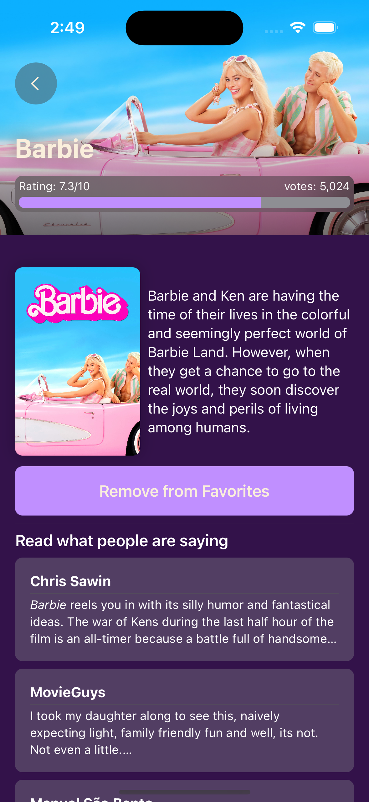

# Movie Finder iOS
A take-home interview project to demonstrate general iOS mobile app development skills within a few hours.

  
   
   
  

## Overview
Welcome to the Movie Finder App, an iOS application built using Swift. This app leverages the TMDB API (The Movie Database) to access recent movies, allowing users to add movies to their favorites, read reviews and ratings, and discover similar films.

## Features

- **Browse New Movies**: Users can explore a list of the latest movies retrieved from the TMDB API. The movie list includes poster images and essential details such as the title and release date.

- **Add Movies to Favorites**: Users can easily add movies to their favorites list. The favorites list is persisted locally on the device, ensuring users can access it even after closing the app.

- **View Movie Details**: By selecting a specific movie, users can access comprehensive information, including a synopsis, user ratings, and reviews.

- **Discover Similar Movies**: While viewing a movie's details, users can also discover a list of similar films, facilitating their exploration of new movies aligned with their interests.

## Getting Started

1. Clone the GitHub repository to your local machine.

2. Open the Xcode project file (`MoviePortfolioApp.xcodeproj`) using Xcode.

3. Create a TMDB API Key:

   - Visit the [TMDB website](https://www.themoviedb.org/documentation/api) and sign up for an API key.
   - In Xcode, navigate to the project's source code and find the `Config.swift` file. Replace `TMDB_API_KEY` with your actual API key.

4. Build and run the app on a simulator or physical iOS device.

## License

This project is licensed under the MIT License - see the [LICENSE.md](LICENSE.md) file for details.

## Acknowledgments

- Special thanks to the TMDB API for providing movie data.
- Fonts used in this app are from [Klim Type Foundry](https://klim.co.nz/collections/national-2/).

Feel free to reach out with any questions or feedback. Enjoy exploring movies with the Movie Portfolio App!
